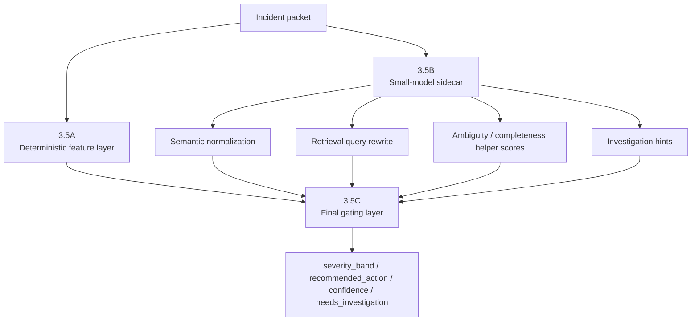

# warning-agent 3.5 small-model sidecar architecture

- status: `design draft / optimization proposal`
- scope: `3.5 first-pass sidecar enhancement`
- last_updated: `2026-04-20`

## 1. Goal

本文档描述一个针对 `warning-agent` `3.5 First-pass` 的优化方案：

> 在不推翻当前 deterministic / calibrated 初筛主逻辑的前提下，
> 引入一个极速小模型 sidecar，
> 为 `3.5` 提供语义增强、检索增强和歧义评估能力。

该方案的目的不是让小模型直接变成新的主判官。

该方案的目的，是让小模型承担：

- 高频
- 低风险
- 高价值
- 结构化

的局部认知工作，从而提升 `3.5` 的初筛质量和对 `3.6` 的输入质量。

## 2. Core judgment

当前最优实践不是：

```text
small model replaces 3.5
```

而是：

```text
small model strengthens 3.5
  -> deterministic scorer remains final gate
```

因此，推荐架构是：

- `3.5A` deterministic feature and threshold layer
- `3.5B` small-model sidecar layer
- `3.5C` final gating layer

## 3. Why this fits warning systems

warning 系统的 `3.5` 本质上要求：

- 高频
- 低延迟
- 高吞吐
- 可回放
- 可校准
- 可审计

这意味着：

- 最终分级不适合完全交给一个小模型自由判断
- 但局部语义增强、query 改写、歧义评分、hint 生成，非常适合用小模型完成

换句话说：

> `3.5` 适合引入小模型做“结构化认知补丁”，
> 不适合把小模型直接升格为最终严重度决策者。

## 4. Current 3.5 truth

当前 `3.5` 已有能力包括：

- packet-based feature extraction
- thresholds / severity band mapping
- retrieval-informed scoring
- deterministic / trained scorer selection
- `needs_investigation` gating

当前架构已经是：

```text
incident packet
  -> feature extraction
  -> scorer
  -> severity / action / confidence / needs_investigation
```

因此 sidecar 必须被设计成：

- 可插拔
- 可关闭
- 不破坏现有主链路

## 5. What the sidecar should do

推荐让 `3.5` sidecar 只负责下面这些任务。

### 5.1 Warning semantic normalization

职责：

- 清洗 noisy alert summary / annotations
- 标准化 operation / endpoint / symptom 表达
- 归并 top error template 的语义近似表达

输出建议：

- normalized symptom phrase
- normalized operation phrase
- normalized warning intent

### 5.2 Retrieval query rewrite

职责：

- 基于 packet 生成更适合查历史 outcome 的 query
- 去掉噪音 token
- 补充高价值 symptom token
- 生成 1 到 3 个 retrieval query candidates

输出建议：

- `primary_retrieval_query`
- `secondary_retrieval_queries`
- `query_terms_used`

### 5.3 Ambiguity and evidence-completeness helper scores

职责：

- 给当前 packet 的语义层面辅助打分
- 不是直接决定 severity

输出建议：

- `ambiguity_score`
- `context_completeness_score`
- `pattern_knownness_score`
- `semantic_novelty_hint`

### 5.4 Investigation hint generation

职责：

- 为 `3.6A` 生成轻量 investigation hints
- 不做最终定位

输出建议：

- recommended trace ids to inspect first
- recommended downstream target hints
- recommended repo search phrases
- recommended evidence follow-up order

## 6. What the sidecar must not do

这是最关键的边界。

sidecar 不应直接负责：

- 最终 `severity_band`
- 最终 `recommended_action`
- 最终 `needs_investigation`
- 最终 `page_owner / send_to_human_review` 决策
- 最终 training truth

理由：

- warning 系统需要可校准与可审计性
- 高代价动作不应由一个极速小模型自由决定
- 否则很容易造成 drift、false page 和回放不可解释

## 7. Recommended architecture



## 8. IBM Granite series fit analysis

下面的判断以 IBM 官方资料和官方模型卡为基础。

### 8.1 Relevant official facts

IBM 官方和官方模型卡给出的几个关键事实：

1. **Granite 3.3 2B Instruct**
   - 2B 参数
   - 128K context
   - 明确支持：
     - summarization
     - text classification
     - text extraction
     - RAG
     - code-related tasks
     - function-calling
   - 官方模型卡把它定位为通用 instruction-following 模型  
   参考：
   - IBM Granite 3.3 2B model card
   - IBM Granite docs

2. **Granite 3.0 / 3.3 8B Instruct**
   - IBM 官方明确把 8B instruct 描述为：
     - sophisticated workflows
     - tool-based use cases
     - function calling strong performer  
   参考：
   - IBM Granite 3.0 announcement

3. **Granite Code models**
   - IBM Granite Code 家族明确面向：
     - code generation
     - code explanation
     - code fixing
     - code editing
   - 官方文档提供 `3B / 8B / 20B / 34B` 档位  
   参考：
   - Granite Code docs

### 8.2 What this means for warning-agent 3.5

对 `warning-agent` 的 `3.5 sidecar` 来说，Granite 系列的最相关结论是：

- 如果任务主要是：
  - 语义标准化
  - retrieval query rewrite
  - 轻量分类 / 提取
  - ambiguity helper score
  那么 **Granite 3.3 2B Instruct** 是合理候选

- 如果任务开始涉及：
  - 多步工具调度
  - 更复杂的 evidence synthesis
  - repo/code hit relevance judgment
  那么 **Granite 8B Instruct** 更稳

- 如果任务进一步强调：
  - 代码相关性
  - code hit ranking
  - code path explanation
  那么可以考虑 **Granite Code 3B/8B Instruct**

## 9. Recommended Granite mapping

### Option A. Default recommended sidecar

推荐默认：

- `Granite 3.3 2B Instruct`

适用于：

- semantic normalization
- retrieval query rewrite
- ambiguity / completeness helper scoring
- lightweight investigation hint generation

原因：

- 更轻
- 更快
- 128K context 足以吃 packet + small retrieval context
- 官方能力覆盖分类、提取、RAG、function-calling

### Option B. When 2B is not enough

升级到：

- `Granite 3.3 8B Instruct`

适用于：

- packet 语义非常复杂
- query rewrite / evidence hint 对最终质量影响很大
- 希望 sidecar 更稳定地处理多源线索
- 准备让 sidecar承担更重的“证据压缩”工作

### Option C. Code-oriented sidecar specialization

如果你希望 sidecar 对 repo/code 搜索的参与更强，考虑：

- `Granite Code 3B Instruct`
- 或 `Granite Code 8B Instruct`

适用于：

- code hit relevance ranking
- suspected path normalization
- code evidence summarization

但不建议一开始就让 code model 同时承担所有 sidecar 任务。

## 10. My judgment on Granite sizes

综合来看：

### 10.1 For 3.5 sidecar default

我认为：

- **`Granite 3.3 2B Instruct` 值得优先试**

原因：

- 它足够快
- 官方能力覆盖 text classification / extraction / RAG / function calling
- 非常适合 `3.5` 这种“高频、局部、结构化”的 sidecar 任务

### 10.2 For 3.5 sidecar heavy-duty expansion

如果你发现 sidecar 实际承担的任务已经变成：

- evidence compression
- code hit semantic ranking
- more complex multi-hop hint construction

那我会建议：

- 升到 `Granite 8B Instruct`
- 或把 code 子任务拆给 `Granite Code 3B/8B`

### 10.3 What I would not do

不建议：

- 让 `Granite 2B` 直接负责最终 severity/action
- 让 `Granite 2B` 直接定义 `needs_investigation`
- 让 `Granite 2B` 直接变成最终 training truth 来源

## 11. Recommended output contract

建议 sidecar 的输出固定为一个内部契约，例如：

- `SidecarAssistPacket`

至少包含：

- `normalized_warning_summary`
- `normalized_symptom_phrase`
- `primary_retrieval_query`
- `secondary_retrieval_queries`
- `ambiguity_score`
- `context_completeness_score`
- `pattern_knownness_score`
- `recommended_trace_focus`
- `recommended_repo_search_phrases`
- `sidecar_notes`

这个输出再喂给：

- retrieval
- feature extraction
- final scorer

## 12. Recommended insertion policy

最合理的接入方式是：

1. packet 已生成
2. sidecar 先运行
3. retrieval / feature layer 消费 sidecar 输出
4. final scorer 仍是主判官

也就是说：

```text
packet
  -> sidecar semantic assist
  -> retrieval + feature extraction
  -> deterministic / calibrated scorer
  -> final first-pass decision
```

## 13. Evaluation criteria

不要只看小模型答得像不像。

要重点看下面几个指标：

1. false page rate
2. severe recall
3. investigation hit rate
4. retrieval quality uplift
5. sidecar latency
6. sidecar token cost
7. replay explainability

如果 sidecar 让：

- retrieval 更准
- severe recall 更好
- false page 不上升
- latency 可接受

那它就值得。

## 14. Final recommendation

最终推荐是：

> 在 `warning-agent` 的 `3.5` 中引入 small-model sidecar 是合理且符合最佳实践的。
> 这个 sidecar 最适合承担语义标准化、retrieval query rewrite、歧义/完整度辅助评分和 investigation hint 生成。
> 对于 IBM Granite 系列，建议先从 `Granite 3.3 2B Instruct` 作为默认 sidecar 起步；
> 若 sidecar 的职责扩张到更重的证据压缩和代码相关判断，再升级到 `Granite 8B Instruct` 或引入 `Granite Code` 系列做代码子任务。

最重要的边界是：

> sidecar 增强 `3.5`，但不替代 `3.5` 的最终主判决层。
