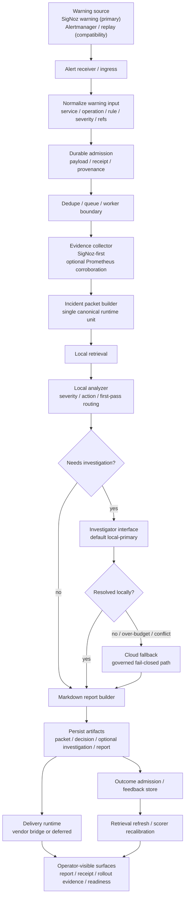

# warning-agent full flow and production gap

- status: `draft / architecture and rollout gap summary`
- scope: `end-to-end warning flow + current production readiness verdict`
- last_updated: `2026-04-20`

## 1. One-sentence summary

`warning-agent` 的完整目标不是“保存全部 SigNoz 数据”，而是：

> 接收真实 warning，
> 拉取有边界的关键证据，
> 生成统一 `incident packet`，
> 进行 first-pass 分析，
> 在需要时进入更深调查，
> 最终输出标准报告、交付结果和反馈证据。

## 2. Full end-to-end flow



## 3. What each stage means

### 3.1 Warning ingress

系统首先接收 warning。

目标不是自己替代 SigNoz 做持续监控，而是：

- 接住 SigNoz 已经判定值得报警的事件
- 补充兼容入口：
  - Alertmanager webhook
  - replay / fixture

### 3.2 Normalize and admit

收到 warning 后，先把输入压成统一格式，再建立 durable receipt。

这一步的作用是：

- 让外部 warning 进入系统后有据可查
- 让后面的 worker / retry / audit 有统一对象

### 3.3 Evidence collection

系统不会抓全量原始 observability 数据，而是只抓分析需要的 bounded evidence：

- SigNoz alert context
- failing traces
- top operations
- trace details
- logs-by-trace if available
- optional Prometheus corroboration

### 3.4 Packet

所有下游都只消费统一中间表示：

- `incident packet`

这是当前系统最重要的结构性约束。

### 3.5 First-pass analysis

这一步负责快速回答：

- 严重吗
- 先给谁
- 现在最可能是什么问题

不是每条 warning 都直接进入重调查。

### 3.6 Investigation

只有在 first-pass 认为不确定、高风险、冲突或者证据不足时，系统才进入调查层。

默认路径：

- local-primary

必要时才：

- cloud fallback

### 3.7 Report

系统最终产品不是聊天记录，而是结构化 Markdown 报文。

这份报文应该回答：

- 为什么报警
- 当前信号是什么
- 怀疑哪里出问题
- 影响和路由是什么
- 建议怎么处理
- 还有哪些未知

### 3.8 Delivery and feedback

报告生成后会继续进入：

- delivery runtime
- outcome admission
- feedback refresh
- retrieval refresh / scorer recalibration

也就是说，项目不是只做一次性报警，而是有闭环学习能力。

## 4. Current state by stage

| Stage | Current state | Production-ready? | Notes |
|---|---|---|---|
| Signoz-first input contract | landed | `partial` | Signoz 已是 primary input truth |
| Signoz-first runtime path | landed | `partial` | 已可跑 packet / decision / investigation / report |
| Outcome admission baseline | landed | `partial` | 已有 receipt 与 evidence trail，但治理不完整 |
| Delivery env-gated vendor seam | landed | `partial` | 已有 `adapter-feishu` seam，但不等于 production rollout |
| Provider runtime gate | landed | `partial` | 已有 `smoke_default / missing_env / ready` truth |
| Rollout evidence baseline | landed | `partial` | `/readyz` 与 sidecar evidence 已存在 |
| Dedicated Signoz production ingress | not complete | `no` | 仍是明显 successor gap |
| Queue / worker / dedupe production boundary | not complete | `no` | 仍缺 durable processing boundary |
| Multi-env auth / secret / rollout governance | not complete | `no` | 仍缺 environment-specific governance |
| Production-ready claim | not reached | `no` | 当前只能 claim `production integration bridge landed` |

## 5. Is the project production-ready now?

结论：

**还没有达到完整的 production-ready warning plane。**

更准确的判断是：

- 当前已经达到：
  - `production integration bridge landed`
- 当前还没有达到：
  - `production-ready rollout completed`

通俗地说：

- 现在系统已经证明“这条 warning 分析链路能跑”
- 但还没有证明“这条链路已经可以在真实生产环境中长期、稳定、受治理地跑”

## 6. What is already true today

当前已经成立的事实：

1. Signoz 已经是 primary warning truth。
2. 系统可以基于 Signoz-first evidence 生成 packet、做 first-pass、必要时 investigation、产出 report。
3. delivery seam、provider gate、rollout evidence baseline 都已经落地。
4. 系统已经具备 machine-readable evidence，而不是只停留在口头 claim。

## 7. What is still missing

当前距离 production-ready 的差距，主要不是“分析能力不足”，而是“生产治理面不足”。

核心差距有四类：

### 7.1 Missing production ingress governance

还缺：

- dedicated Signoz live ingress surface
- caller auth / signature / identity
- durable provenance truth for live external warning producers

### 7.2 Missing durable processing boundary

还缺：

- dedupe
- queue
- worker lifecycle
- retry / dead-letter policy

没有这层，系统仍然更像 runtime/smoke path，而不是 production ingestion plane。

### 7.3 Missing environment-specific rollout governance

还缺：

- secret / credential handling policy
- remote vendor rollout policy
- multi-environment enablement checklist
- explicit rollback / disable procedure

### 7.4 Missing provider live rollout governance

还缺：

- real provider rollout beyond local proof
- serving deployment / client lifecycle governance
- environment-specific failure policy

## 8. The most accurate production verdict

今天最准确的表述应该是：

> `warning-agent` 已经具备 Signoz-first 的 bounded warning analysis pipeline，
> 并且已经落地 integration bridge、delivery seam、provider gate 和 rollout evidence baseline；
> 但它还不是一个已经完成生产治理的 warning plane，
> 因为 dedicated ingress、durable queue/worker boundary、auth/secret/multi-env rollout governance 仍未完成。

## 9. What W7 changes

W7 不是重做分析链路。

W7 要做的是把下面这句话补完整：

```text
warning received
  -> trusted ingress
  -> durable admission
  -> durable processing boundary
  -> bounded analysis and localization
  -> report and delivery
  -> operator-visible audit and governance
```

也就是说，W7 完成后，项目最核心的提升将是：

- warning 进入系统这件事变得生产可用
- warning 被处理这件事变得生产可治理
- warning 的分析和定位结果变得生产可审计

而不是“拿到全部 SigNoz 数据”。
