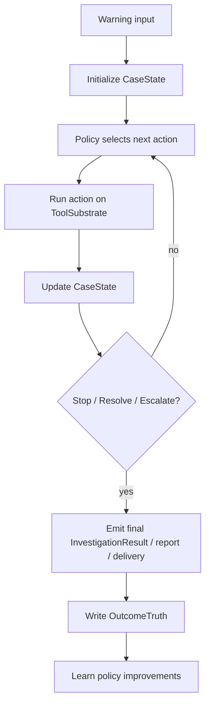

# warning-agent post-orchestration general intelligence architecture

- status: `design draft / long-horizon target architecture`
- scope: `post-orchestration warning intelligence system`
- last_updated: `2026-04-20`

## 1. Goal

本文档定义 `warning-agent` 在更长期、更加符合 `The Bitter Lesson` 底层哲学时的终极技术目标。

这里的目标不是继续细化：

- `3.5A`
- `3.5B`
- `3.5C`
- `3.6A`
- `3.6B`

这类显式人工编排。

这里的目标是把 `warning-agent` 从“阶段编排系统”逐步提升为：

> 一个以统一状态、通用工具、学习型策略和 outcome 真值为中心的 warning intelligence system。

## 2. Why a post-orchestration architecture is needed

当前系统已经在向更合理的结构演进：

- `3.5` 初筛
- `3.6A` 搜证与压缩
- `3.6B` 高质量定性

这一步是正确的，也是当前工程上必须走的中间形态。

但从 `The Bitter Lesson` 的角度看，它仍然保留了较强的人工编排痕迹：

- 先定义阶段
- 再定义阶段职责
- 再定义某个模型在哪一层工作
- 再定义下一步应该做什么

这类架构短期可执行，但长期会不断面临：

- 新 warning 类型出现时要重新编排
- 新工具接入时要重新编排
- 新模型替换时要重新编排
- 搜证 / 停止 / 升级逻辑增长后，越来越依赖人写流程

更符合长期智能系统方向的方式，不是继续堆流程，而是：

> 让系统围绕统一状态与策略决策循环运行，
> 阶段只作为当期实现，不再成为最高层真相。

## 3. Core philosophy

### 3.1 The Bitter Lesson interpretation for warning-agent

对于 `warning-agent`，`The Bitter Lesson` 不应被理解为：

- 无限制使用更大的模型
- 把所有推理都交给一个万能 agent
- 放弃结构化对象和治理边界

而应被理解为：

1. 少把智能固化在人工流程树里
2. 多把智能放在：
   - 状态表示
   - 通用工具调用
   - 可学习策略
   - 真值驱动反馈
3. 让模型和策略在统一 substrate 上工作，而不是每次新需求都重写流程

### 3.2 What remains fixed

在更通用的智能架构里，以下几项仍应保持稳定：

- `incident packet` 作为 canonical runtime unit
- bounded observability and repo tools
- `InvestigationResult` / report / outcome 这些稳定外部契约
- outcome-governed learning
- fail-closed behavior

也就是说：

> 更通用，不代表更松散。  
> 更智能，不代表更无边界。

## 4. Final target architecture

长期最终形态建议围绕 4 个统一对象构建：

1. `CaseState`
2. `ToolSubstrate`
3. `Policy`
4. `OutcomeTruth`

### 4.1 `CaseState`

`CaseState` 是 warning-agent 的统一状态对象。

它不只记录“这条告警是什么”，还记录“系统目前知道了什么”。

推荐包含：

- warning identity
- normalized alert
- incident packet
- retrieval hits
- evidence refs
- selected traces / logs / code refs
- candidate causes
- routing hints
- unknowns
- evidence gaps
- tool usage
- token usage
- wall time
- current confidence
- recommended next action

核心思想：

> 系统不再主要围绕“当前在哪个阶段”工作，  
> 而是围绕“当前 CaseState 还缺什么”工作。

### 4.2 `ToolSubstrate`

所有外部能力都应被视为统一工具 substrate，而不是某个阶段的私有能力。

包括：

- SigNoz traces
- SigNoz trace details
- SigNoz logs-by-trace
- SigNoz top operations
- Prometheus corroboration
- retrieval search
- repo search
- evidence compression
- report rendering
- delivery / outcome writeback

这些能力不应被概念上强绑定到：

- `3.6A`
- `3.6B`
- `local_primary`
- `cloud_fallback`

它们应该只是：

- 可被策略选择的 action substrate

### 4.3 `Policy`

这是长期最该学习的部分。

策略层不等于“写更多 if/else 流程”，而是要决定：

- 什么时候继续搜证
- 什么时候停止
- 什么时候升级更强模型
- 什么时候直接输出
- 什么时候 defer / human review
- 哪些 warning 值得花更高预算

建议至少拆成 4 类策略：

- `TriagePolicy`
- `EvidenceSearchPolicy`
- `StopPolicy`
- `PremiumReasoningPolicy`

### 4.4 `OutcomeTruth`

系统最终增强自己的依据，不能来自模型自我判断，而应来自真值对象。

`OutcomeTruth` 推荐包含：

- final incident severity truth
- final recommended action truth
- actual owner / team / handler
- actual root cause label if known
- actual resolution path
- whether alert was true positive / false positive
- whether escalation was correct
- whether investigation steps were useful / wasteful

这才是后续学习和策略改进的真正来源。

## 5. Unified decision loop

最终形态的核心运行方式，不应再是“固定阶段图”，而应是“统一决策循环”。

这条循环体现的不是阶段，而是：

- 状态
- 行动
- 更新
- 停止
- 学习

## 6. What becomes transitional implementation only

在这种最终架构下，当前的这些概念应逐步被降级为“实现层术语”，而不再是最高真相：

- `3.5`
- `3.6A`
- `3.6B`
- `local_primary`
- `cloud_fallback`
- `small-model sidecar`
- `premium reasoner`

这些概念依然有用，但它们应该被理解成：

- 当前策略版本的执行形态

而不是：

- 系统永久边界

## 7. How current docs fit into this future

### 7.1 `warning-agent-3.5-small-model-sidecar-architecture.md`

这个文档仍然有价值。

它代表：

- 当前阶段对 `TriagePolicy` 的一次工程实现

也就是说，它不是最终架构真相，而是：

- `TriagePolicy v1`

### 7.2 `warning-agent-two-stage-investigation-architecture.md`

这个文档也仍然有价值。

它代表：

- 当前阶段对 `EvidenceSearchPolicy + PremiumReasoningPolicy` 的一次工程实现

也就是说，它不是最终架构真相，而是：

- `InvestigationPolicy v1`

## 8. Learning mechanism in the final architecture

### 8.1 What should be learned

长期最应该学习的不是固定 prompt，而是策略：

#### `TriagePolicy`

学习：

- 哪些告警最终值得 investigation
- 哪些 signals 更能预测 severe outcome
- 哪些 sidecar hints 更有价值

#### `EvidenceSearchPolicy`

学习：

- 哪些 tool calls 最有信息增益
- 哪种 trace / log / repo search 路径最有效
- 哪些 warning 类型需要更深搜证

#### `StopPolicy`

学习：

- 什么时候证据已经足够
- 什么时候继续搜证只是浪费
- 什么时候该升级更强模型

#### `PremiumReasoningPolicy`

学习：

- 什么样的 compressed brief 最能让强模型一次给出高质量结论
- 哪些 evidence pack 结构最稳

### 8.2 What must not be learned directly from model outputs

必须避免：

- 让 `3.6` 自己定义 `3.5` 的训练真值
- 让 premium model 的 conclusion 直接变成 label
- 让工具调用轨迹未经 outcome 校验就固化为策略

必须坚持：

- outcome-governed truth
- explicit compare / retrain / promotion review

## 9. Why this is more faithful to The Bitter Lesson

更符合 `The Bitter Lesson` 的点在于：

1. 它把“智能”从人工流程树转移到了：
   - 状态表示
   - 通用工具
   - 可学习策略
   - outcome truth
2. 它让新的模型、新的工具、新的 warning 类型接入时，不必总是重写主流程
3. 它使系统未来可以更多地学习：
   - 搜证策略
   - 停止策略
   - 压缩策略
   - 升级策略

而不是只学习：

- 下一个 prompt 怎么写

## 10. Migration strategy

不建议直接抛弃现有 `3.5/3.6` 文档并一次性全量重构。

推荐迁移顺序：

### Step 1. Keep current execution docs as transitional truth

继续保留：

- `3.5 sidecar`
- `3.6 two-stage`

因为它们对当前工程推进仍然最有用。

### Step 2. Introduce stable intermediate objects

先在实现层引入：

- `CaseState`
- `InvestigationEvidencePack`
- `CompressedInvestigationBrief`
- `DecisionAuditRecord`
- `OutcomeTruthRecord`

### Step 3. Move phase logic into explicit policies

把当前写死在流程里的规则，逐步抽成：

- triage policy
- evidence search policy
- stop policy
- premium reasoning policy

### Step 4. Learn policies from outcome truth

不是先学习“提示词”，而是先学习：

- 哪些策略有效
- 哪些策略浪费
- 哪些搜证动作最终提升结论质量

## 11. Rebuild now or evolve gradually?

结论：

**更高效的是渐进演进，不是现在直接重写一个新的综合体系。**

理由：

### 如果现在直接重写

优点：

- 架构更纯
- 概念更统一

缺点：

- 当前 `3.5` / `3.6` 还在快速收敛，直接重写会打断现有验证链
- 会同时重开：
  - state model
  - tool orchestration
  - policy engine
  - learning loop
- 回归风险极高
- 很容易在“追求更通用”时丢掉当前已经落地的 bounded contracts

### 如果渐进演进

优点：

- 保留现有 runtime truth
- 继续沿用现有 tests / artifacts / report / feedback surfaces
- 可以逐步把阶段式实现“托举”为状态式架构
- 风险更小，验证更容易

缺点：

- 一段时间内仍然会看到双层概念：
  - 阶段术语
  - 策略术语

### Recommendation

推荐：

> 用当前 `3.5/3.6` 文档继续推进工程实现，  
> 但把本文件作为长期真相，逐步把执行逻辑迁移到 `CaseState + ToolSubstrate + Policy + OutcomeTruth` 这套通用智能架构上。

## 12. Final judgment

最终判断：

> `warning-agent` 更符合 `The Bitter Lesson` 的最终技术目标，
> 不应停留在人工阶段编排系统；
> 它应逐步演进为一个以统一状态、通用工具、学习型策略与 outcome 真值为核心的 warning intelligence system。

在实现路径上：

> 不是现在推倒重写最有效率，  
> 而是以当前 `3.5/3.6` 作为过渡实现，  
> 逐步把系统迁移到后编排时代的通用智能架构上。
