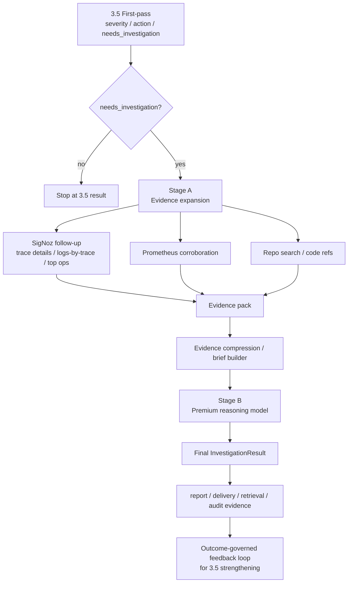

# warning-agent two-stage investigation architecture

- status: `design draft / optimization proposal`
- scope: `3.6 investigation architecture refinement`
- last_updated: `2026-04-20`

## 1. Goal

本文档描述一个针对 `warning-agent` `3.6 Investigation` 的优化方案：

> 将当前相对耦合的 investigation 流程，
> 升级为更符合 warning 系统最佳实践的分层调查架构：
> `本地搜证与压缩` + `高级模型一次性定性与定位`

设计目标不是追求“更复杂”。

设计目标是：

1. 提高 investigated case 的结论精度
2. 降低高级模型在多轮工具往返中的 token 浪费
3. 降低强模型对实时工具调度能力的依赖
4. 让 `3.6` 更符合 warning 任务的本质：
   - 先搜到足够证据
   - 再做高质量定性
5. 保持：
   - bounded investigation
   - replayability
   - auditability
   - outcome-governed feedback

## 2. Current 3.6 truth

### 2.1 What 3.6 is today

当前 `3.6` 的职责是：

- 接收 `3.5` 输出的 `packet + decision`
- 在需要时进入 investigation
- 生成结构化 `InvestigationResult`

当前已落地的能力包括：

- Signoz-first investigation path
- bounded Prometheus corroboration
- bounded repo search
- structured `InvestigationResult`
- local-primary real-adapter seam
- cloud-fallback compressed handoff

### 2.2 Current integrated flow

当前的典型路径是：

```text
3.5 needs_investigation
  -> local_primary investigation
    -> packet hints
    -> trace details follow-up
    -> logs-by-trace follow-up
    -> top operations follow-up
    -> repo search
    -> local reasoning
    -> InvestigationResult
  -> if not clear enough
    -> cloud_fallback compressed handoff
    -> cloud reasoning
    -> final InvestigationResult
```

### 2.3 Current architectural tension

当前实现里存在两种并不完全一致的 `3.6` 形态：

1. `smoke / local tool-driven path`
   - 在 `local_primary.py` 中，工具往返和结论生成耦合在一起
2. `real adapter path`
   - 在 `local_primary_openai_compat.py` 中，模型直接消费一个 bounded request 并一次性返回结果

这说明当前 3.6 已经出现了隐含分层，但尚未被提升为明确的架构真相。

## 3. Why optimize now

如果本地模型换成较弱的本地模型，例如 `gemma4`，问题会更明显：

- 弱模型在复杂多跳工具调度 + 高质量定性这两件事同时承担时，容易整体变弱
- 工具往返会引入大量局部噪音
- 强模型若直接参与多轮工具搜索，token 成本和延迟都不可控

换句话说，当前问题不只是“哪个模型更强”，而是：

> 是否把“搜证”和“定性”这两类本质不同的任务，
> 交给了同一个 investigation provider 一次性完成。

这通常不是最佳实践。

## 4. Best-practice principles

warning / diagnosis 系统里，更稳的最佳实践通常遵循下面几条原则：

### 4.1 Separate evidence gathering from evidence interpretation

把“找证据”与“解释证据”拆开。

- 找证据：
  - 强约束
  - 低层次
  - 可预算
  - 可程序主导
- 解释证据：
  - 高层次
  - 跨来源整合
  - 更适合强模型一次完成

### 4.2 Keep strong models on the highest-value step

最强模型不应该主要用来决定“下一步查哪个 trace”。

最强模型应该主要用来：

- 综合证据
- 构造 failure chain
- 输出更强的定位结论

### 4.3 Preserve boundedness

即便拆成两段，也不能演化成无边界 observability exploration。

必须继续保留：

- tool call budget
- trace/log/code ref caps
- compressed handoff budget

### 4.4 Preserve outcome-governed learning

调查结论再强，也不能直接定义 `3.5` 的学习真值。

增强 `3.5` 的来源仍应是：

- outcome
- 处置结果
- 明确标签
- compare / retrain / promotion review

而不是 3.6 自我闭环。

## 5. Proposed architecture

推荐把当前 `3.6` 升级成一个二段式架构。

### 5.1 Stage A: Evidence Expansion and Compression

职责：

- 基于 `packet + decision` 做多轮 bounded follow-up
- 从 SigNoz / Prometheus / repo 搜到足够多的关键证据
- 形成结构化证据包和压缩摘要

当前推荐默认模型策略：

- 默认使用 **本地 `26B/27B` 级模型** 作为 Stage A 的 evidence-builder / compressor
- `4B` 级模型只作为未来成本优化候选，不作为当前默认真相

原因：

- 当前 warning 任务中的 Stage A 仍然需要一定程度的链路理解、证据整理和压缩保真
- 如果默认模型太弱，Stage A 更容易在“关键证据召回”“conflicting signal 保留”“repo 相关信息筛选”上失真

这个阶段允许：

- 程序主导
- 本地 `26B/27B` 模型辅助
- 或“规则 + 本地 26B/27B 模型”的混合模式

这个阶段**不负责最终高置信定性**。

### 5.2 Stage B: Premium Reasoning

职责：

- 接收 Stage A 输出的高质量压缩证据包
- 由高级模型一次性完成：
  - suspected cause
  - failure chain
  - routing
  - hypotheses
  - unknowns
  - final recommendation refinement

这个阶段应该尽量避免再去做重度多轮工具往返。

## 6. Proposed end-to-end flow



## 7. Stage A details

### 7.1 Responsibility

Stage A 负责：

- 追 trace
- 找下游链路
- 补 logs-by-trace
- 看 top operations
- 做 repo search
- 做少量 Prometheus corroboration
- 标记 strongest signals
- 标记 conflicting signals
- 标记 evidence gaps
- 形成可供高级模型消费的压缩 brief

Stage A 不负责：

- 给最终结论背书
- 直接决定“最可信 failure chain 就是它”
- 直接决定最终 `suspected_primary_cause`
- 直接决定最终 `recommended_action`
- 直接决定最终 `escalation_target`
- 过早裁剪 conflicting evidence
- 把 uncertain link 压成单一确定关系
- 用本地模型自由扩写不受 refs 支撑的推断

### 7.2 Output

推荐把 Stage A 的输出固定成一个新的内部契约，例如：

- `InvestigationEvidencePack`

至少包含：

- packet id / decision id
- selected trace ids
- selected log refs
- selected signoz refs
- selected prometheus refs
- selected code refs
- observed downstream targets
- candidate repo/module surfaces
- residual evidence gaps
- compression metadata

### 7.3 Compression

Stage A 最后还应再输出一个：

- `CompressedInvestigationBrief`

它不是 full evidence dump，而是：

- 证据摘要
- strongest signals
- conflicting signals
- still-open unknowns
- omitted evidence summary
- evidence completeness estimate
- search trajectory summary
- why selected trace / log / code refs are included
- explicit caps / omitted details

推荐再显式包含：

- final question for Stage B
  - 例如：
    - `given this bounded evidence pack, what is the most likely primary cause, failure chain, routing target, and what remains unknown?`
- whether code evidence is:
  - direct
  - heuristic
  - partial
- whether downstream mapping is:
  - packet-carried
  - actively verified
  - still inferred

## 8. Stage B details

### 8.1 Responsibility

Stage B 应该被重新理解成：

- `premium reasoner`

而不只是“fallback model”。

如果每个 investigated case 都会进入这一步，那么从产品语义上看，它已经不是 fallback，而是：

- investigated case 的主定性模型

当前推荐默认策略：

- **每个进入 `3.6` 的 investigated case 默认都会执行一次 Stage B**
- 旧的 `cloud_fallback` 命名可以暂时保留以兼容当前代码结构
- 但架构语义上，Stage B 已应被视为 investigated case 的 **default premium reasoner**

### 8.2 Input

Stage B 只消费：

- `CompressedInvestigationBrief`
- `InvestigationEvidencePack`
- 当前 `packet`
- 当前 `decision`

Stage B 不应承担：

- 重度多轮搜证调度
- 低层次工具调用选择
- 重新决定是否值得查更多基础证据

Stage B 的默认工作假设应是：

- Stage A 已经完成一轮 bounded evidence gathering
- 证据已经被压成高信噪比 brief
- 当前问题是“如何解释证据”，不是“从哪里继续找”

### 8.3 Output

Stage B 输出仍保持当前 `InvestigationResult` 契约：

- `summary`
- `hypotheses`
- `routing`
- `evidence_refs`
- `unknowns`
- `analysis_updates`

这样才能和当前 report / delivery / feedback 路径无缝兼容。

## 9. Difference from current implementation

| Topic | Current integrated 3.6 | Proposed two-stage 3.6 |
|---|---|---|
| 搜证与定性 | 耦合在一个 provider 中 | 分离成 Stage A / Stage B |
| 本地弱模型角色 | 同时承担搜证与定性可能吃力 | 主要承担搜证、整理、轻压缩 |
| 高级模型角色 | 仅在本地不清楚时 fallback | investigated case 的 premium reasoner |
| token 使用 | 多轮往返时易膨胀 | 强模型通常只做一次最终定性 |
| 工具调度 | provider 内部混合 | Stage A 明确承担 |
| 审计与复盘 | 结果可复盘，但中间层不清晰 | evidence pack / brief / final result 三层更清晰 |

## 10. Why this fits warning-task best

warning 系统的本质不是生成最聪明的自由推理，而是：

1. 快速判断是否值得查
2. 低成本搜集关键证据
3. 对少量高价值 case 给出高质量结论
4. 输出标准化、可执行、可审计的结果

两段式 `3.6` 正好对应这个本质：

- `3.5`：判断值不值得查
- `3.6A`：把关键证据搜齐
- `3.6B`：给出高质量结论

这比“让一个模型全程自己找自己想”更符合 warning 任务。

## 11. Risks

### 11.1 Stage A may compress too aggressively

如果 Stage A 过早裁剪证据，会把偏见带入 Stage B。

必须避免：

- 过早下最终结论
- 过早丢弃 conflicting evidence
- 把 uncertain link 压成确定关系

### 11.2 Premium reasoner every time changes semantics

如果每个 investigated case 都进入高级模型，那么：

- 这一步不再是 fallback
- 需要重新定义成本预算、SLO、observability 和治理语义

### 11.3 Truth loop must remain outcome-governed

即使 Stage B 很强，也不能让它直接成为 3.5 的真值来源。

否则会形成模型自我强化偏差闭环。

## 12. Recommended naming shift

如果采用这个方案，建议概念上改名：

- `local_primary`
  - 从“本地调查模型”
  - 转为“evidence builder / local orchestrator”
- `cloud_fallback`
  - 从“仅在失败时 fallback”
  - 转为“premium reasoner”

为了兼容当前代码，可以先保留原名称，但在文档中明确新语义。

## 13. Implementation contour

推荐的代码拆分方向：

### 13.1 New internal modules

- `app/investigator/evidence_pack.py`
- `app/investigator/evidence_builder.py`
- `app/investigator/brief_builder.py`
- `app/investigator/premium_reasoner.py`

### 13.2 Existing modules likely to change

- `app/investigator/runtime.py`
- `app/investigator/router.py`
- `app/investigator/local_primary.py`
- `app/investigator/cloud_fallback.py`
- `app/investigator/base.py`

### 13.2.1 Migration rule from current code

从当前实现迁移到本方案时，最关键的桥接原则是：

1. 从 `local_primary.py` 中抽出“多轮搜证和证据整合”逻辑
   - 形成独立 `Stage A`
2. 保留当前 `InvestigationResult` 作为最终输出契约
3. 将当前 `real adapter` 路径与未来高级云端模型路径统一收敛到 `Stage B`
4. 不再让任何单一 provider 同时承担：
   - 主要搜证
   - 最终高置信定性

换句话说：

- 当前 `local_primary.py` 中的 trace/details/logs/repo follow-up 逻辑，应该迁移到 `Stage A`
- 当前 `local_primary_openai_compat.py` 中的 bounded request -> one-shot result 模式，应该成为 `Stage B` 的参考基型

### 13.3 Compatibility rule

最终仍统一产出：

- `InvestigationResult`

不要把 report / delivery / feedback 层再拆出第二套契约。

## 14. Recommended rollout policy

如果未来采用本方案，推荐的运行策略是：

1. `3.5` 仍保持轻量初筛
2. investigated case 默认进入 Stage A
3. Stage A 默认使用本地 `26B/27B` 模型 + 程序主导搜证
4. Stage B 默认对每个 investigated case 执行一次
4. 若成本压力过高，再用 policy gate 缩减 Stage B 覆盖率

也就是说：

- Stage A 是 default evidence builder
- Stage B 是 default premium reasoner
- 不推荐再从产品语义上把 Stage B 当成“偶发 fallback”

## 15. Final judgment

最终判断：

> 该优化方案符合 warning 系统最佳实践。
> 它比当前“搜证 + 定性耦合”的 3.6 更清晰、更稳、更节省强模型 token，
> 尤其适合“本地模型偏弱、但希望高级模型高精度给最终结论”的场景。

但成立的前提是：

1. Stage A 只负责搜证与压缩，不提前做最终结论
2. Stage B 被明确视为 premium reasoner，而不是名义 fallback
3. 3.5 的持续增强仍坚持 outcome-governed truth，不允许 3.6 自我定义训练真值
