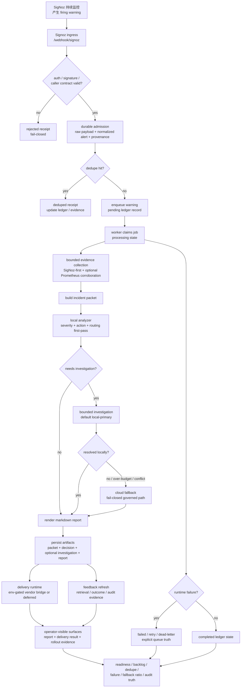

# warning-agent W7 production warning flow

- status: `draft / W7 target-state visualization`
- scope: `Signoz warning ingress -> bounded analysis and localization -> report and audit`
- last_updated: `2026-04-20`

## Overview

这张图描述的是：

- `W7` 完成后，`warning-agent` 在生产态下如何接收 `SigNoz` 告警
- 告警如何进入 durable admission、去重、排队、worker 消费
- 告警如何进入现有的 `packet -> analyzer -> investigation -> report` 主链路
- fail-closed、交付、反馈、审计是如何挂到同一条链路上的

## Mermaid



## Reading guide

从产品视角看，这条链路分成四段：

1. `Signoz warning ingress`
   - 负责接收真实告警并建立 durable receipt
2. `queue + worker boundary`
   - 负责去重、排队、重试、失败显式化
3. `bounded analysis and localization`
   - 负责 packet、first-pass、必要时 investigation、最终报告
4. `operator governance`
   - 负责 delivery、feedback、readiness、audit、rollout truth

## Key boundary

W7 完成后，`warning-agent` 仍然不是：

- 全量 SigNoz 数据副本
- observability platform
- 无边界 root-cause engine

W7 完成后，`warning-agent` 应该是：

> 一个生产可用的 Signoz 告警接入与治理面，
> 能把每条告警稳定送入有边界的分析、定位、报告和审计闭环。
```
